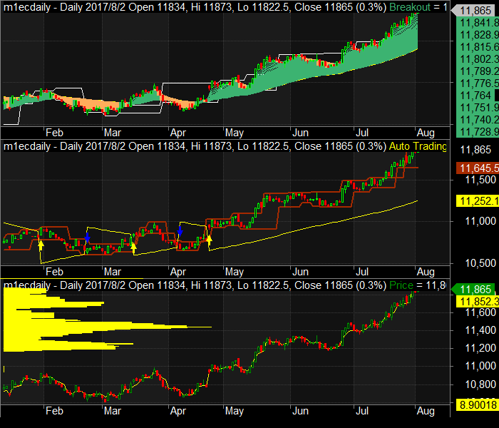
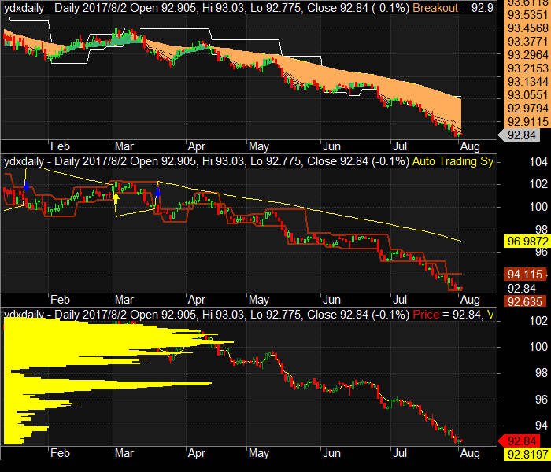
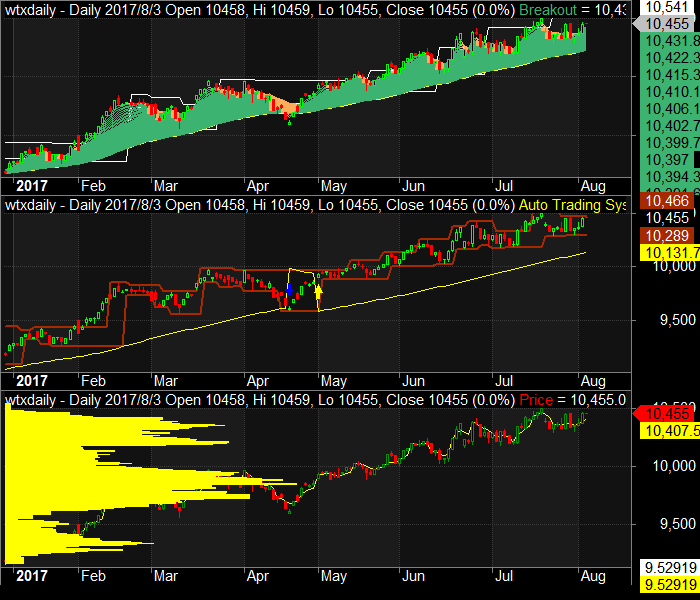
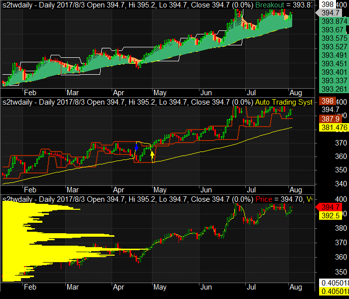

# 2017/08/02 #
Author: Jared Liang ( jeweiliang@gmail.com )
Twitter: [Trader Jared](https://twitter.com/jaredliangtw) / @jaredliangtw
## News Summary ##
* The ADP NFP came out at 178K jobs in July, slightly below 185K expected, but nothing too extraordinary. 
* Merkel's Conservatives maintain 40% support in latest Forsa election poll. That 40% support level remains the best since Sept 2015 and is the largest amongst the current pollsters.
* Private-sector payrolls in the US should firm up in today’s ADP data for July
* With no Fed hike likely in the near term, the 2-year UST yield will stay range-bound
* The firmer euro may serve to constrain inflation to below the ECB's 2% target
* Strong Apple results lift Asian technology shares
## Forex Market ##
### EUR/USD ###

### US Dollar Index ###

## Stock Index Futrues ##
### Taiwan Index Futures ###

### Taiwan Electronic Sector Index Futures ###

### Taiwan Financial Sector Index Futures ###

### SGX Taiwan Index Futures ###

### USD/TWD ###

### Nasdaq ###

