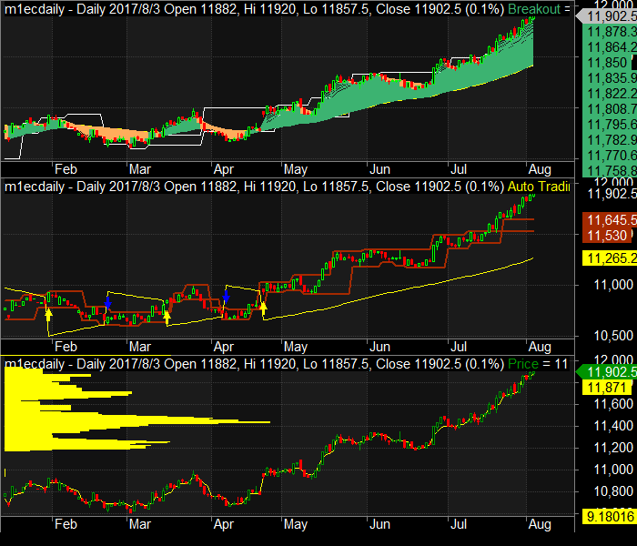

# 2017/08/04 #
Author: Jared Liang ( jeweiliang@gmail.com )
Twitter: [Trader Jared](https://twitter.com/jaredliangtw) / @jaredliangtw
## News Summary ##
* ISM non-manufacturing 53.9 vs. 56.9 Exp . Employment drops to 53.6 vs. 55.8. not good for NFP

## Forex Market ##
### EUR/USD ###

### US Dollar Index ###

## Stock Index Futrues ##
### Taiwan Index Futures ###

### Taiwan Electronic Sector Index Futures ###

### Taiwan Financial Sector Index Futures ###

### SGX Taiwan Index Futures ###

### USD/TWD ###

### Nasdaq ###

### 2330 ###

### 2317 ###

