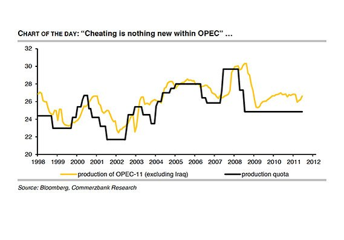
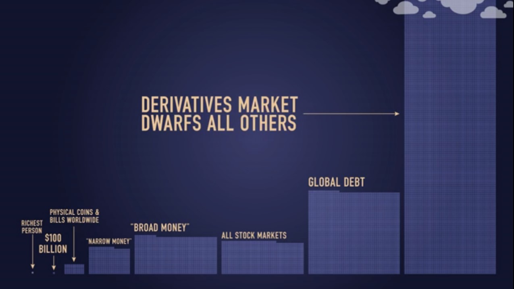
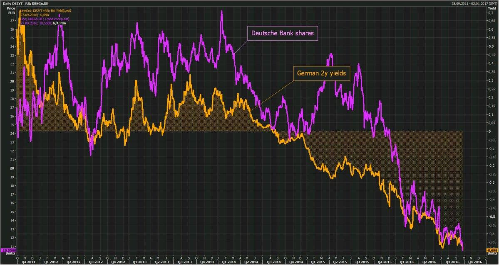
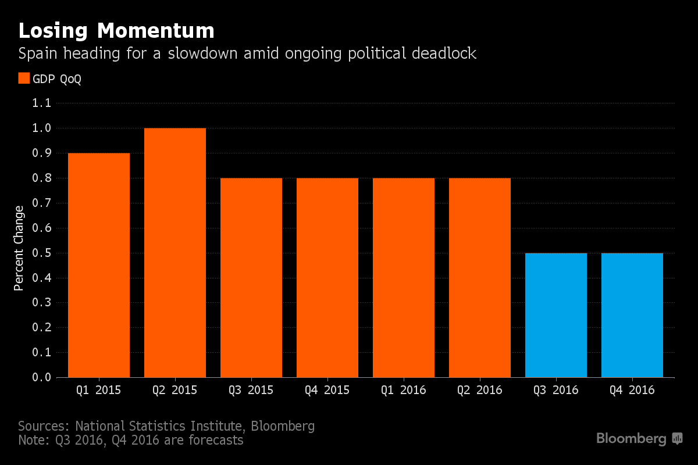
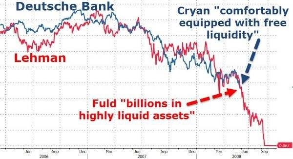
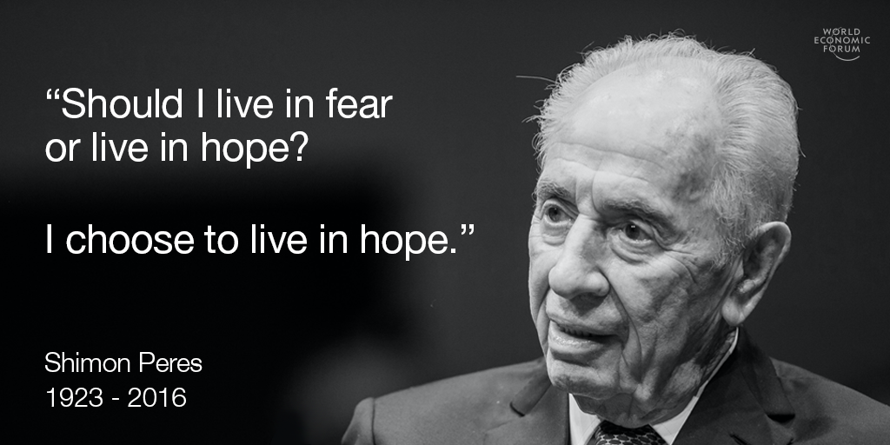
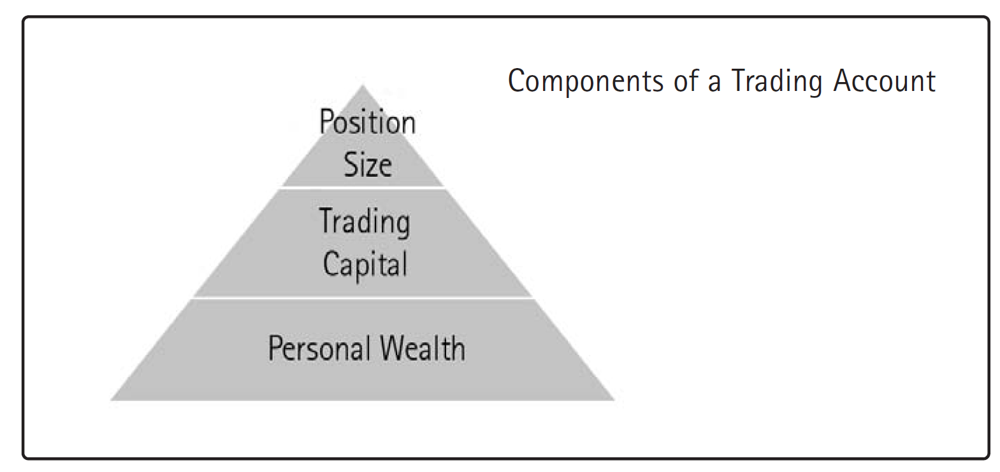
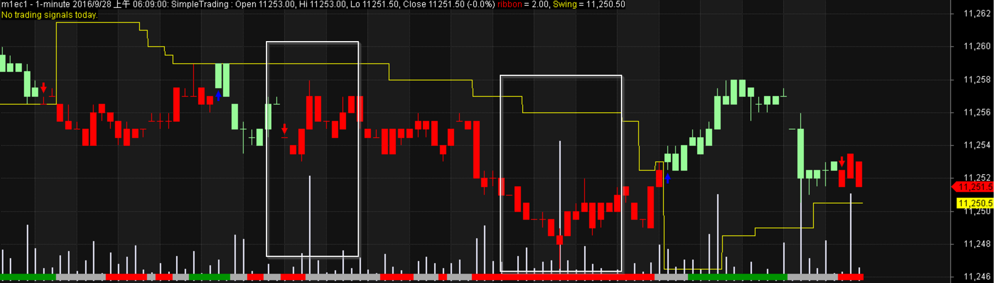
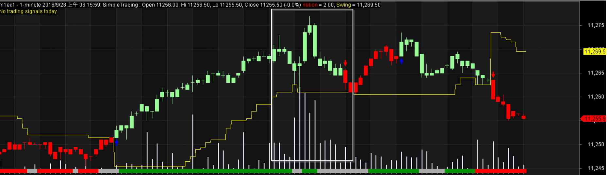
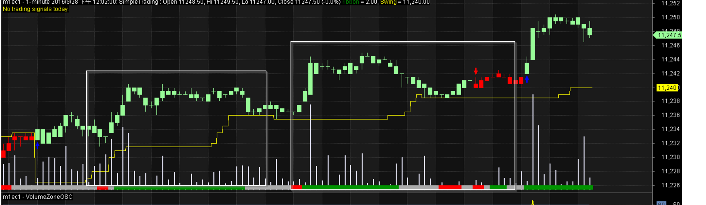

## 2017/08/02 ##
* [Technical Analysis Charts](20170802.md)

## 2017/08/01 ##
* [Technical Analysis Charts](20170801.md)

## 2017/07/29 ##
* [Technical Analysis Charts](20170729.md)

ps ax |grep pred |grep py  | awk '{ print $1 }' |xargs kill

ps ax |grep min |grep py  | awk '{ print $1 }' |xargs kill -9

* COT: 重點放在投機部位上，也就是舊版的NON-COMMERCIAL(非商業持倉)以及新版的LEVERAGED FUNDS(槓桿基金)淨部位。

## 2017/07/20 ##
* The ECB's Balance Sheet Is Now The Size Of Japan's GDP

## 2017/07/19 ##
`News Summary`

* The euro has pushed above the 1.15 line and is trading at its highest levels since May 2016. The currency received a boost on Tuesday, following the news that the Republicans will not attempt to advance their health care proposal before Congress takes a recess in August. This decision is a major setback to President Trump, who has tried to pass a health care bill which would replace Obamacare, but opposition from some Republican lawmakers has meant that the White House does not have the votes to pass such a bill.
* "ECB continues moving closer to eventual policy normalisation". By normalisation it is meant a reduction in quantitative easing - or asset purchases in ECB-speak.  
* Nice options trading strategies:

## 2017/07/18 ##
`News Summary`

* There are doubts in the minds of traders over Fed monetary policy and the ability for Trump to deliver that are driving selling pressure on the dollar.
* Italy risk spread over Germany keeps falling ahead of Thursday's #ECB meeting as mkts expect no guidance change on the QE program this mth
* Analysts remain upbeat about the path of the German economy
* ZEW’s index covering the current economic situation dipped from June, but only very slightly, reaching 86.4 in July from 88. That’s a slight miss compared to forecasts. The expectations index also dipped to 17.5.

* Helpful summary:

## 2016/10/02 ##

`Trading System Development`

 * [Search for similar patterns in history](searchinhist.md)

## 2016/09/30 ##
`News Summary`
 * Fed’s Harker Backs December Rate Rise if Growth Stays on Track
 * China 7-day repo fixing drops by 30bps to 2.55%
 * Equities Tumble on Deutsche Bank Jitters, Swiss Franc Surges
 * Oil prices continue to fall as doubts over OPEC agreement build

   

`Reading`  

 * Morning Page: Every morning, soon after waking, you must write 750 words—equivalent to about three full pages longhand. The idea is to start while your brain is too bleary to censor itself, so you can write more freely. In general, filling three pages takes about a half hour. She says the inconvenience of handwriting compared to typing is worth it because “we get a truer connection—to ourselves and our deepest thoughts—when we actually put pen to
https://www.weforum.org/agenda/2016/09/this-morning-ritual-could-help-you-this-is-how-it-works?utm_content=bufferce56a&utm_medium=social&utm_source=facebook.com&utm_campaign=buffer

## 2016/09/29 ##
`News Summary`

* US GDP growth revised up to 1.4% in Q2
* A higher oil price would also be supportive for the US inflation outlook potentially reinforcing the Fed’s confidence that it will return to their 2.0% target, and encouraging the Fed to continue gradually tightening monetary policy in the year ahead offering support for the US dollar.
* Chinese billionaire Wang Jianlin made his fortune in the country's real estate market -- and now he's warning that it's spiraling out of control.
* OPEC Agrees to First Oil Output Cut in Eight Years
* Commodity currencies firm, yen sags after OPEC oil curb agreement – RTRS
* WTO Says Global Trade in Its Worst Year Since Financial Crisis
* US Forex Traders Numbers Rise for the First Time Since 2012: Investment Trends
* USD: Weak US capital spending has continued into Q3 - MUFG. The latest durable goods report released yesterday revealed that core shipments continued to contract in August signalling that capital investment has likely remained a drag on growth in Q3 for the fourth consecutive quarter.

`Reading`  

* How much money have human created http://www.valuewalk.com/2016/09/much-money-humans-created/

  

* "If you get up in the morning and think the future is going to be better, it is a bright day. Otherwise, it's not." - Elon Musk

## 2016/09/28 ##
`EURUSD`  

 * ECB could run out of Bunds to buy as soon as November, raising the likelihood of technical changes to QE at the October 20 meeting (Citi)
 * Germany's 2y bond yields hit record low as Deutsche rout deepens. Yields should rather rise as bail out risk rises. http://reut.rs/2dvVENm  
 * S&P Sees Slowdown but No Recession for UK and Euro Zone After Brexit. The Bank of England’s decision to expand its bond-buying programme had calmed the British gilt market and S&P expected the country’s housing market would have only a “soft landing” because of low interes

   
 * Spain Seen Losing Momentum as Threat of New Vote Rises: Chart  

    
 * EUR will be the diminishing prospects for aggressive ECB easing from here. In particular, the Governing Council will have to deal with issues like asset scarcity and the flatness of the EGB curve. We expect the ECB to announce more measures that will allow it to lengthen the duration of its programme this December.
 * We doubt that it will be able to continue buying EGBs at current pace beyond 2017, however. As a result market expectations of a QE taper could intensify next year. All this will likely make EUR a less attractive funding currency and should help lift the long end of the EGB curve relative to the rest of G10.
 * Leman vs. DB

   

`Reading`

 * Live in hope:

   

 * "The three elements of successful trading are: Cutting losses, cutting losses,
 cutting losses. If you can follow these rules, you may have a chance!"
 * Pay-off ratio: average winning trade / average losing trade. Greater than 1 and you are
making more when you win, than you lose when you lose; less than 1
and your losses are greater than your wins.
 * “Always have a two-way exit strategy; know when you plan to cut your
profits, as well as when to cut your losses. These can be revised frequently,
but always refer back to the initial plan to keep that sense of perspective.”
 * Trading is simple, not easy.
 * The research done in behavioural finance suggests that the majority of people
in a situation of gain will become risk averse (take less risk); whilst in a
situation of loss they are more likely to become risk-taking. In trading terms,
the majority of people when in a winning position are likely to cut the winner,
whilst in a situation of loss they are likely to run the loss.
 * When you take excessive risk in relation to your trading account, you are creating a higher level of mental engagement and stress, which impacts upon your decisionmaking.
 * Trading Position:

   

 `Technical Analysis`  

 - Volume Spike Patterns

   

   

   

## 2016/09/27 ##
* Thought: Set profit taking point at first.
* High Frequency Trading Price Prediction using LSTM Recursive Neural Networks: https://github.com/dzitkowskik/StockPredictionRNN
* CNN for predict stock movement: https://github.com/kimber-chen/Tensorflow-for-stock-prediction
* model tuner: https://github.com/wzchen/stock_market_prediction/blob/master/model_tuner.py
* trend: linregress(trades_n.index.values, trades_n.price.values)[0]
* fetch news and clustering: https://github.com/edtechre/Yahoo-Finance-and-Google-Finance-NMF
* sentiment on financial data: https://github.com/NanditaRao/Sentiment-Analysis-On-Finance-Data

## 2016/09/26 ##

`EURUSD`

* German business sentiment surged to the highest level in more than two years in September in a sign that corporate concerns are easing over the economic outlook and the consequences of Britain’s decision to leave the European Union

* Some forecasters think the U.S. economy is on track for 3% growth this quarter, best in two years

* Reading..
