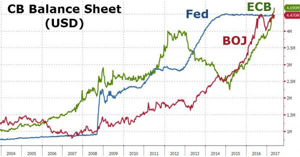
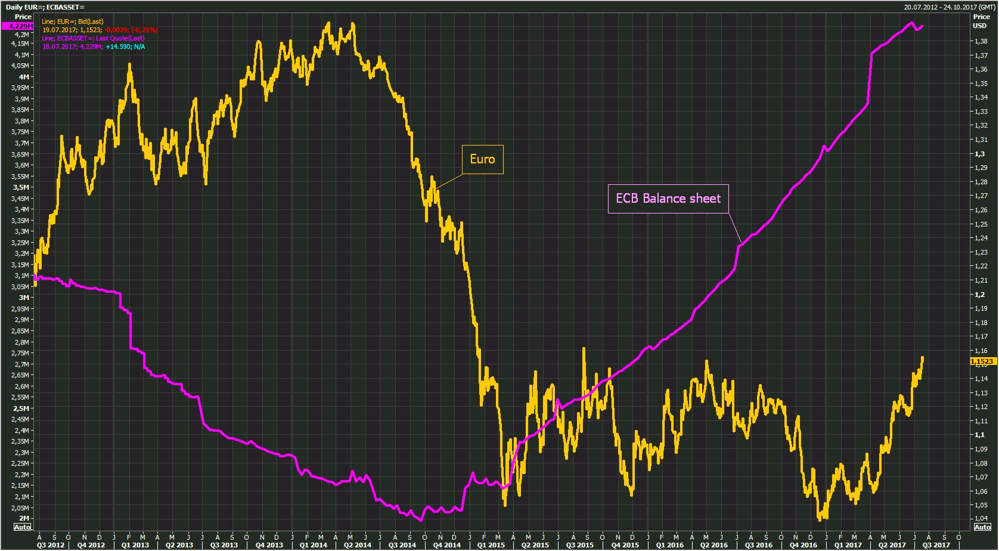
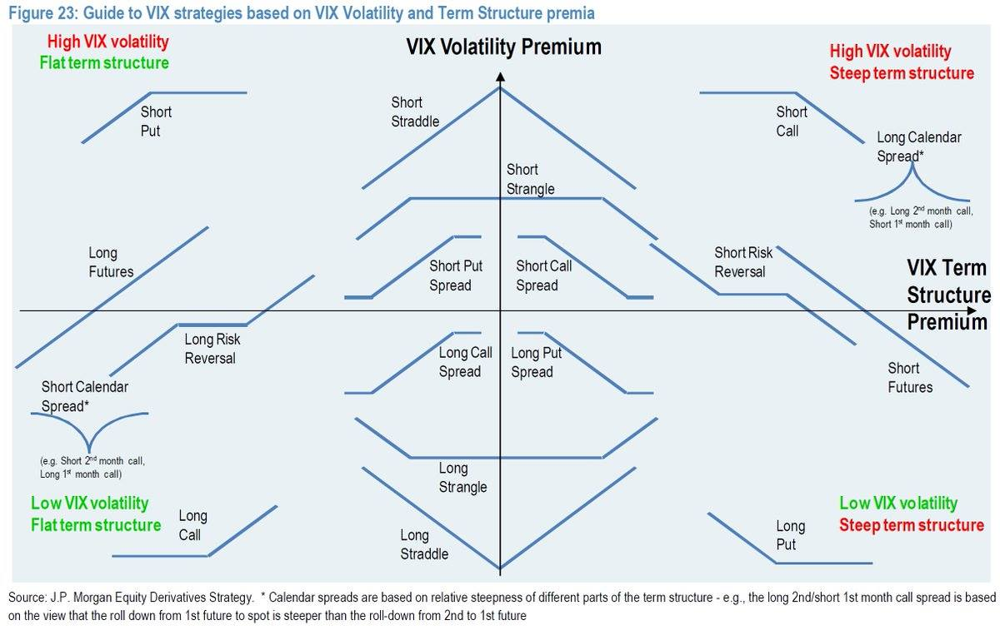
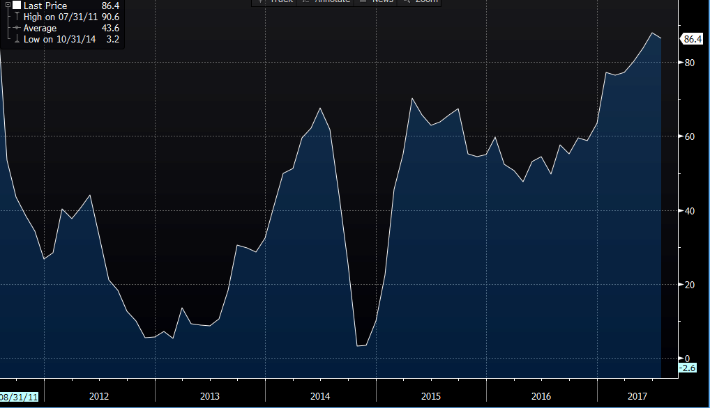
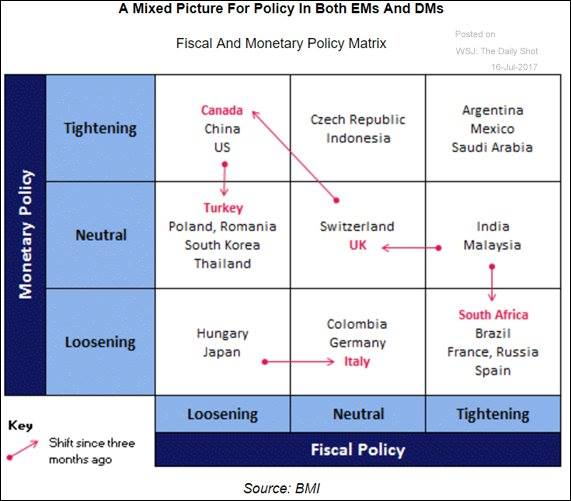

## 2017/08/02 ##
* [Technical Analysis Charts](20170802.md)

## 2017/08/01 ##
* [Technical Analysis Charts](20170801.md)

## 2017/07/29 ##
* [Technical Analysis Charts](20170729.md)

## 2017/07/20 ##
* The ECB's Balance Sheet Is Now The Size Of Japan's GDP

## 2017/07/19 ##
`News Summary`

* The euro has pushed above the 1.15 line and is trading at its highest levels since May 2016. The currency received a boost on Tuesday, following the news that the Republicans will not attempt to advance their health care proposal before Congress takes a recess in August. This decision is a major setback to President Trump, who has tried to pass a health care bill which would replace Obamacare, but opposition from some Republican lawmakers has meant that the White House does not have the votes to pass such a bill.
* "ECB continues moving closer to eventual policy normalisation". By normalisation it is meant a reduction in quantitative easing - or asset purchases in ECB-speak.  
* Nice options trading strategies:

## 2017/07/18 ##
`News Summary`

* There are doubts in the minds of traders over Fed monetary policy and the ability for Trump to deliver that are driving selling pressure on the dollar.
* Italy risk spread over Germany keeps falling ahead of Thursday's #ECB meeting as mkts expect no guidance change on the QE program this mth
* Analysts remain upbeat about the path of the German economy
* ZEW’s index covering the current economic situation dipped from June, but only very slightly, reaching 86.4 in July from 88. That’s a slight miss compared to forecasts. The expectations index also dipped to 17.5.

* Helpful summary:

## 2016 Archive ##
* [2016 Archive](2016.md)
