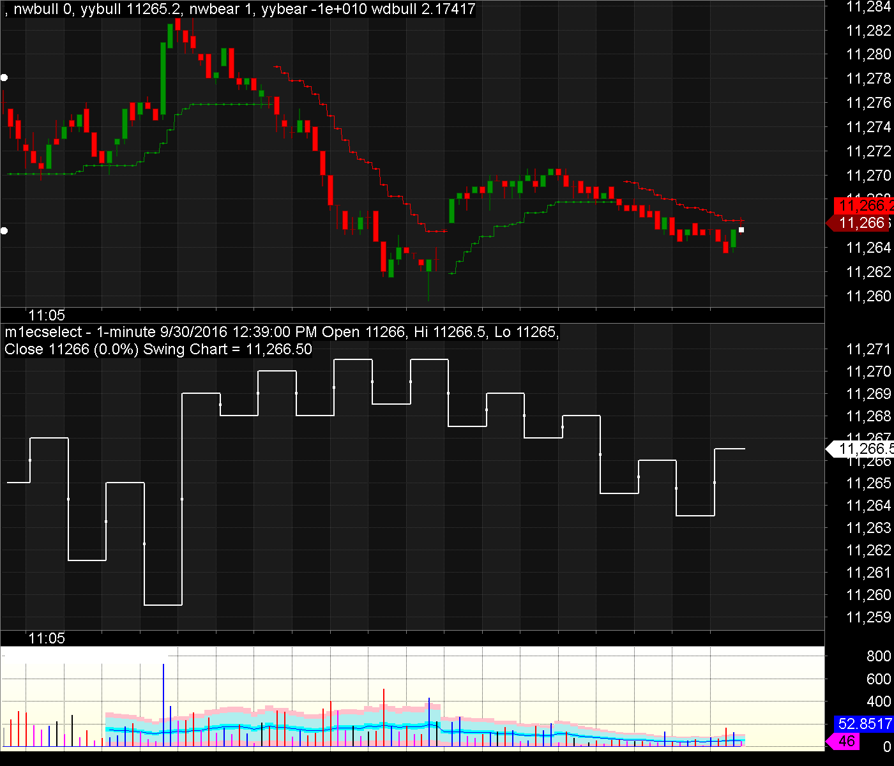
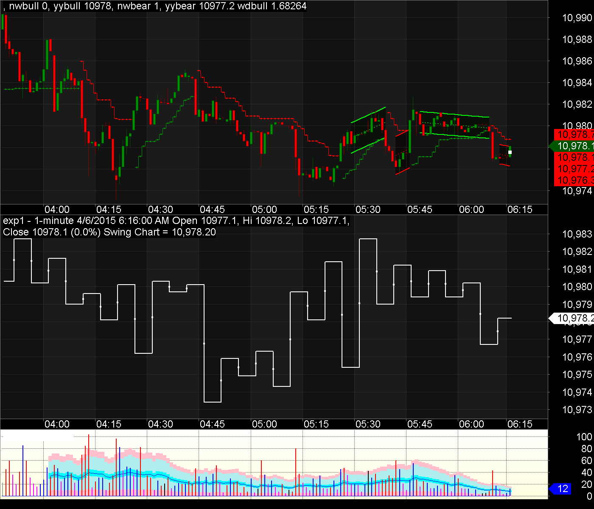
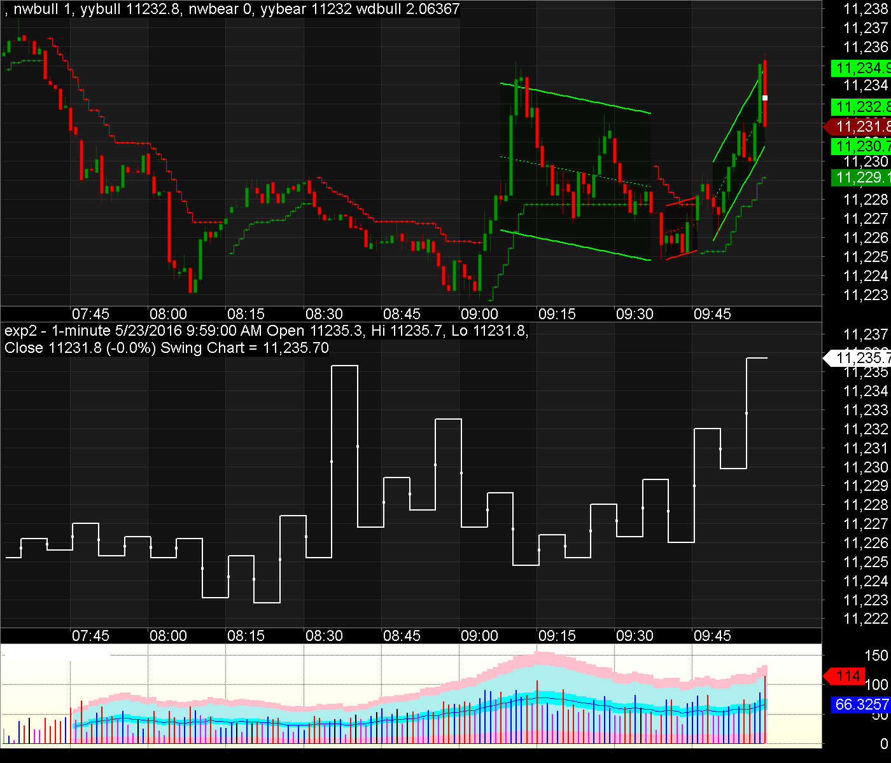
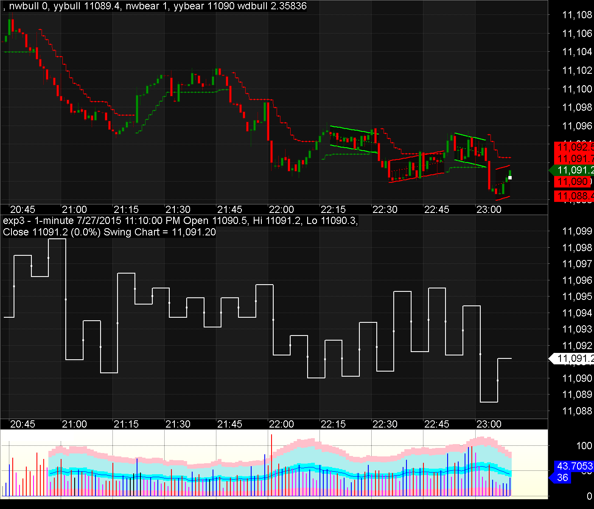

# Find top N most similar charts in history #

## Objectives ##
 * Find N KBar segment of lenth 100 that was most similar to current ones and also shown 70 KBars after the found segment. Technical analysis programs were based on the assumption that history will repeat itself, and this program automatically find some similar patterns in history that may repeat again.

## Algorithms ##
 * Similarity calculation: Scikit-learn (sklearn.metrics.pairwise.cosine_similarity)
 * Vector Representation:
   * Zigzag Patterns
   * Distance between MAs(7,13,23,37) and current price
   * Slope (linear regression) of MAs
   * Candlestick patterns
   * Number of bullish bars and bearish bars 

## Datasets ##
 * EURUSD 1min in Metatrader format
  http://www.fxdd.com/us/en/forex-resources/forex-trading-tools/metatrader-1-minute-data/
 * Python parser for Metatrader file format (by Daniel Fernandez at mechanicalForex.com) http://mechanicalforex.com/2015/12/converting-mt4-binary-history-files-hst-to-csv-using-a-python-script.html

## Result ##
 * Original data (100 Bars)

   

 * Top 3 similar chart in history (100 + 70 Bars):

   

   

   
